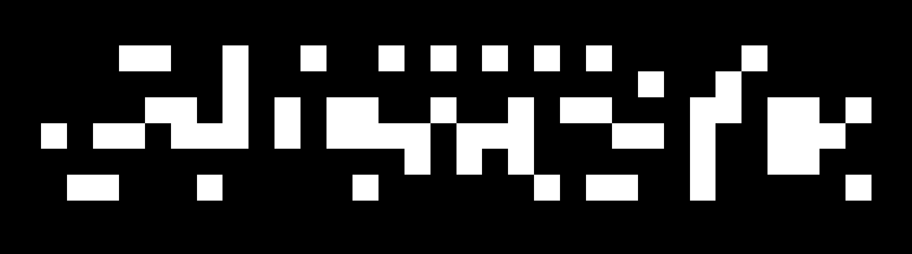

# Exhaustive Predecessor Searcher (EPS)

This is a search program that can find the predecessors of any pattern in a 2-state range-1 Moore neighbourhood cellular automaton.

This program uses a divide-and-conquer approach. In most cases, this is vastly superior to cell-by-cell techniques like lifesrc-based approaches, as it is able to figure out and eliminate local contradictions much earlier. Its performance is comparable to the performance of modern SAT solver-based methods, but it has the advantage that it can easily enumerate ALL predecessors.

It is also less of a black-box algorithm, so there are several things that can be tweaked to try and heuristically find good predecessors.

## Usage


To run this code, you need to have [Rust](https://rust-lang.org/tools/install/) installed. The program takes RLE-encoded inputs only, so you should ideally have some program (like [Golly](https://golly.sourceforge.io/)) that can handle RLE patterns.

Once you have Rust and Cargo successfully installed, you can run (for example)
```bash
cargo run --release -- -v 0 deep-search -i examples/herschel.rle -g 15
```
This should quickly find a 15-generation predecessor of the Herschel.

This search program has 2 modes: deep search and exhaustive search. The former mode simply takes the pattern and keeps growing the bounding box and selecting the best predecessor found (according to the cost) till the desired generation is reached.

The latter mode is much more flexible, but is designed to search only for direct predecessors (1 generation back). It allows you to constrain both the desired generation and its predecessor, and allows you to set unknown cells in the desired generation too. This can be achieved via multistate rle’s, where non-1/0 cells are assumed to be unknown. An example command in this mode is
```bash
cargo run --release -- exhaustive-search -i examples/e1.txt -t examples/e0.txt --outputfile output.txt
```
Here are all the command-line arguments:
```bash
Usage: eps [OPTIONS] <COMMAND>

Commands:
  deep-search        Tries to search for an n-gen predecessor, using the given heuristic (default: low population) to choose the best predecessor.
  exhaustive-search  Tries to search for every 1-gen predecessor, using the given heuristic to sort predecessors.
  help               Print this message or the help of the given subcommand(s)

Options:
  -v, --verbosity <VERBOSITY>  [default: 1]
  -c, --cfg-file <FILE>        [default: b3s23.cfg]
      --cull-mode <CULL_MODE>  [default: keep-low-cost] [possible values: exhaustive, keep-low-cost, keep-random]
      --cullfrac <CULLFRAC>    [default: 0.1] [only used with --cull-mode keep-low-cost]
  -h, --help                   Print help

Usage: eps deep-search [OPTIONS] --inputfile <FILE>

Options:
  -g, --gens <GENS>                                                [default: 1]
  -i, --inputfile <FILE>                                           
  -n, --n-patterns-to-print-per-gen <N_PATTERNS_TO_PRINT_PER_GEN>  [default: 3]
  -l, --limit-patterns-midlayer <LIMIT_PATTERNS_MIDLAYER>          [default: 100000000]
  -f, --limit-patterns-finallayer <LIMIT_PATTERNS_FINALLAYER>      [default: 1000000]

Usage: eps exhaustive-search [OPTIONS] --inputfile <FILE>

Options:
  -i, --inputfile <FILE>                                       
  -t, --templateoutput <FILE>                                  
  -o, --outputfile <FILE>                                      [default: preds.txt]
  -l, --limit-patterns-midlayer <LIMIT_PATTERNS_MIDLAYER>      [default: 100000000]
  -f, --limit-patterns-finallayer <LIMIT_PATTERNS_FINALLAYER>  [default: 1000000]
      --cull-high-pop  
      Searches faster by eliminating certain boards with duplicate behaviour. This makes the search non-exhaustive, but it will still never miss a solution as long as at least one exists.                                 
```
The rule and cost criteria must be specified in the configuration file, which is by default set to Conway’s game of life (i.e. b3s23) with a penalty for high population. To generate the default config file for other outer-totalistic rules, you can use the given script gen_cfg.py

If you want to use a custom scoring criteria or non-outer-totalistic rules, you can manually generate the config file. Its syntax has been inspired by Golly’s rule table format. Every line consists of 9 comma-separated numbers, each representing an allowed transition (similar to a rule table). This is followed by an equals sign and a number, which represents the cost you want to add if the transition appears. In essence, each line is just:
```
C,N,NE,E,SE,S,SW,W,NW,C'=cost
```
Eg:
```
0,1,1,0,0,0,0,0,1,1=-1
```
represents the transition (x means undetermined)
```
***    xxx
... -> x*x
...    xxx
```
with a $-1$ contribution to cost. One thing to be aware of is that it does not support any symmetries, so you must manually specify all possible rotations and reflections of the board.

## Idea

The basic idea is to repeatedly split the board in question along the longer side into 2 parts recursively, creating a tree data structure.
For example, a 4x4 board would be divided as
```
####       ##|##     ##|##
####       ##|##     ##|## 
####  -->  ##|## --> --|-- --> ...
####       ##|##     ##|##
                     ##|##
```
We start with the smallest pieces (i.e. $1 \times 1$) and try to enumerate all possible predecessors of this piece among all 3x3 pasts. Once this is done, we begin to merge nodes to calculate the possibilities at higher levels of the tree (so a $k \times k$ node would contain all $(k+2) \times (k+2)$ boards whose core evolves to the desired $k \times k$ node).

This results in a huge number of boards to keep track of, which means some of the boards have to be culled to keep the memory usage under control. And information cannot flow from one cell to another till their least common ancestor. Hence, the program tries to cull all the boards at each layer of the tree, which it can definitively prove aren’t part of any final solution.

